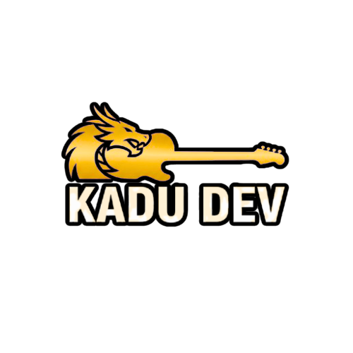

<div align="center">
  

  # Portfólio Pessoal

  Portfólio de **Kadu Ribeiro**, desenvolvido para apresentar experiência, habilidades e projetos em desenvolvimento Full Stack.

  [](https://kadudev.com)
  [](https://nextjs.org/)
  [](https://www.typescriptlang.org/)
  [](assets/LICENSE.md)
</div>

## Sobre o projeto

O **kadudev.com** é meu portfólio profissional. O projeto reúne minha trajetória em tecnologia e telecomunicações, as principais ferramentas com que trabalho e uma seleção de projetos publicados.

A aplicação foi migrada para **Next.js com App Router**, adotando componentes reutilizáveis, tipagem com TypeScript, animações suaves e suporte a temas claro e escuro.

## Funcionalidades

- Interface responsiva para desktop, tablet e celular
- Tema claro e escuro com preferência persistente
- Hero com chamadas para projetos e contato
- Seção profissional com habilidades e trajetória
- Cards de projetos com demonstração e código-fonte
- Formulário de contato integrado ao Formspree ou e-mail padrão
- Animações de entrada com Framer Motion
- Metadados para SEO e compartilhamento social
- Política de Privacidade em conformidade com a LGPD e preparada para Google AdSense
- Termos de Serviço

## Tecnologias

| Categoria | Tecnologias |
| --- | --- |
| Framework | Next.js 16, React 19 |
| Linguagem | TypeScript 5 |
| Estilos | Tailwind CSS 4 |
| Animações | Framer Motion |
| Tema | next-themes |
| Ícones | Lucide React |
| Qualidade | ESLint, Prettier |

## Como executar localmente

### Pré-requisitos

- [Node.js](https://nodejs.org/) 20 ou superior
- npm

### Instalação

1. Clone o repositório:

```bash
git clone https://github.com/KaduSR/Portfolio-Pessoal.git
```

2. Acesse a pasta do projeto:

```bash
cd Portfolio-Pessoal
```

3. Instale as dependências:

```bash
npm install
```

4. Crie o arquivo de variáveis de ambiente:

```bash
cp .env.example .env.local
```

5. Inicie o servidor de desenvolvimento:

```bash
npm run dev
```

Acesse [http://localhost:3000](http://localhost:3000) no navegador.

## Configuração do formulário

Para enviar mensagens pelo Formspree, informe o endpoint em `.env.local`:

```env
NEXT_PUBLIC_FORMSPREE_ENDPOINT=https://formspree.io/f/SEU_ID
```

Se a variável não estiver configurada, o formulário abre o aplicativo de e-mail padrão com a mensagem preenchida.

## Scripts disponíveis

| Comando | Descrição |
| --- | --- |
| `npm run dev` | Inicia o ambiente de desenvolvimento |
| `npm run build` | Gera a versão de produção |
| `npm run start` | Executa a versão de produção |
| `npm run lint` | Verifica a qualidade do código |

## Estrutura principal

```text
src/
├── app/
│   ├── politica-de-privacidade/
│   ├── termos-de-servico/
│   ├── globals.css
│   ├── layout.tsx
│   └── page.tsx
├── components/
└── lib/
public/
├── images/
├── logos/
└── og/
```

## Páginas legais

- [Política de Privacidade](https://kadudev.com/politica-de-privacidade)
- [Termos de Serviço](https://kadudev.com/termos-de-servico)

## Contribuição

Sugestões e melhorias são bem-vindas. Consulte o [guia de contribuição](assets/CONTRIBUTING.md) antes de abrir uma issue ou pull request.

## Licença

Distribuído sob a licença MIT. Consulte o arquivo de [licença](assets/LICENSE.md) para mais informações.

---

<div align="center">
  Desenvolvido por <a href="https://github.com/KaduSR">Kadu Ribeiro</a> · <a href="https://kadudev.com">kadudev.com</a>
</div>
